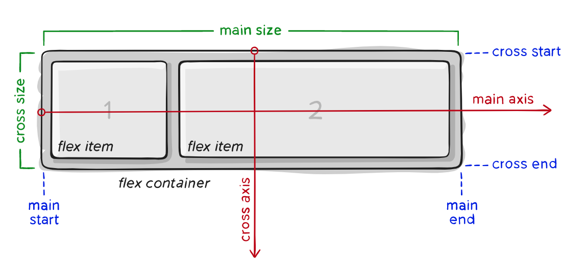

# css備忘

position这个属性很有用。

## 1.  Flex

Flex box已经获得了所有主流brower的支持,可以安全地使用它了.

http://www.ruanyifeng.com/blog/2015/07/flex-grammar.html  可以看一下他在文章里参考的两篇blog

[A Complete Guide to Flexbox](https://css-tricks.com/snippets/css/a-guide-to-flexbox/)  这篇文章非常好，图解的非常清楚。再配合上这个在线的demo，就更好了：[CodePen - Flexbox Properties Demonstration](https://codepen.io/justd/full/yydezN/)

[A Visual Guide to CSS3 Flexbox Properties](https://scotch.io/tutorials/a-visual-guide-to-css3-flexbox-properties)

一定要理解下图中的概念，尤其是main axis和cross axis。



注意如果 

* `flex-direction`设置为row,如果想让内容vertical居中,需要设置`align-items`:center.
* `flex-direction`设置为column,如果想让内容水平居中,需要设置`align-items`:center.
  这个理解一下.

Flex里的属性适用的对象是有区别的：

有一些适合用于Parent的属性，也就是一个container，另一些属性是适用于Children,也就是父容器里包含内容。

举个例子：下面的div就是parent，而span就是children。

```html
<div>
  <span>Hi,Flex!</span> 
</div>
```

### 适用于Parent的属性：

#### display

    默认是row

#### flex-direction

#### flex-wrap

#### flex-flow

#### justify-content

#### align-items

This defines the default behavior for how flex items are laid out along the **cross axis** on the current line. Think of it as the `justify-content` version for the cross-axis (perpendicular to the main-axis).

#### align-content

#### gap, row-gap, column-gap

### 适用于children的属性

#### order

#### flex-grow

#### flex-shrink

#### flex-basis

#### flex

#### align-self

### 例子

实现vertical middle:

```css
.vertical-center {
  min-height: 100%;  /* Fallback for browsers do NOT support vh unit */
  min-height: 100vh; /* These two lines are counted as one :-)       */

  display: flex;
  align-items: center;
}
```

`flex-grow` 这个属性如果设置为1,则会填满父元素.

用flexbox来实现sticky header and footer 

https://codepen.io/anthonyLukes/pen/DLBeE

```css
.page {
  display: flex;
  flex-direction: column;
}

.page-header {
  flex: 0 0 auto;
  background-color: #dcdcdc;
}

.page-content {
  flex: 1 1 auto;
  position: relative;/* need this to position inner content */
  overflow-y: auto;
}

.page-footer {
  flex: 0 0 auto;
  background-color: #dcdcdc;
}
```

首行缩进2空格.

```css
text-indent: 2em;
```

```css
white-space: nowrap;
overflow: hidden;    
```

## CSS Units

CSS里常用单位有px,pt,em,vh

W3School的[CSS Units](https://www.w3schools.com/cssref/css_units.asp)这篇文章非常好。

### Absolute Lengths

绝对长度这个很容易理解，我们常用，如px,pt。

| Unit | Description                                                                                              |
| ---- | -------------------------------------------------------------------------------------------------------- |
| cm   | centimeters[Try it](https://www.w3schools.com/cssref/tryit.asp?filename=trycss_unit_cm)                  |
| mm   | millimeters[Try it](https://www.w3schools.com/cssref/tryit.asp?filename=trycss_unit_mm)                  |
| in   | inches (1in = 96px = 2.54cm)[Try it](https://www.w3schools.com/cssref/tryit.asp?filename=trycss_unit_in) |
| px * | pixels (1px = 1/96th of 1in)[Try it](https://www.w3schools.com/cssref/tryit.asp?filename=trycss_unit_px) |
| pt   | points (1pt = 1/72 of 1in)[Try it](https://www.w3schools.com/cssref/tryit.asp?filename=trycss_unit_pt)   |
| pc   | picas (1pc = 12 pt)[Try it](https://www.w3schools.com/cssref/tryit.asp?filename=trycss_unit_pc)          |

### Relative Lengths

相对长度在某些场景下，使用的更多，也能很方便地实现一些布局效果。其中vh,vw很实用。

em是相对于当前元素的字体大小来计算的。

| Unit | Description                                                                               |                                                                                |
| ---- | ----------------------------------------------------------------------------------------- | ------------------------------------------------------------------------------ |
| em   | Relative to the font-size of the element (2em means 2 times the size of the current font) | [Try it](https://www.w3schools.com/cssref/tryit.asp?filename=trycss_unit_em)   |
| ex   | Relative to the x-height of the current font (rarely used)                                | [Try it](https://www.w3schools.com/cssref/tryit.asp?filename=trycss_unit_ex)   |
| ch   | Relative to the width of the "0" (zero)                                                   | [Try it](https://www.w3schools.com/cssref/tryit.asp?filename=trycss_unit_ch)   |
| rem  | Relative to font-size of the root element                                                 | [Try it](https://www.w3schools.com/cssref/tryit.asp?filename=trycss_unit_rem)  |
| vw   | Relative to 1% of the width of the viewport*                                              | [Try it](https://www.w3schools.com/cssref/tryit.asp?filename=trycss_unit_vw)   |
| vh   | Relative to 1% of the height of the viewport*                                             | [Try it](https://www.w3schools.com/cssref/tryit.asp?filename=trycss_unit_vh)   |
| vmin | Relative to 1% of viewport's* smaller dimension                                           | [Try it](https://www.w3schools.com/cssref/tryit.asp?filename=trycss_unit_vmin) |
| vmax | Relative to 1% of viewport's* larger dimension                                            | [Try it](https://www.w3schools.com/cssref/tryit.asp?filename=trycss_unit_vmax) |
| %    | Relative to the parent element                                                            |                                                                                |

min-height: calc(100vh - 86px);

### 响应式字体设计

```css
clamp(0.1rem, 3vw, 2rem)
```


## CSS Grid

据说这东西要替代Flex

https://developer.mozilla.org/en-US/docs/Web/CSS/CSS_Grid_Layout


### CSS Grid template
这个东西真的非常好的东西，可以非常容易的实现页面的header content footer这样的layout。

https://developer.mozilla.org/en-US/docs/Learn/CSS/CSS_layout/Grids#positioning_with_grid-template-areas


[CSS](https://developer.mozilla.org/en-US/docs/Web/CSS) [pseudo-class](https://developer.mozilla.org/en-US/docs/Web/CSS/Pseudo-classes)

```css
/* Selects any <p> that is the first element   among its siblings */
p:first-child {
  color: lime;
}
```


# tailwind CSS


### 垂直剧中
使用`place-items-center`这个就可以了。注意要配合`h-screen`和grid一起使用。
```

```


## 常用CSS

## code 标签的换行
经常看到一些页面里含有code，而且这种通常包裹在pre里的，但是没有做换行。主要问题是打印的时候超出的部分会裁掉，所以需要挑选的。
[html - How do I wrap text in a pre tag? - Stack Overflow](https://stackoverflow.com/questions/248011/how-do-i-wrap-text-in-a-pre-tag)
```css
white-space: pre-wrap;
```


# Sass & Scss
## Sass是什么

Sass 是一门高于 CSS 的元语言，它能用来清晰地、结构化地描述文件样式，有着比普通 CSS 更加强大的功能。Sass 能够提供更简洁、更优雅的语法，同时提供多种功能来创建可维护和管理的样式表。Sass 是采用 Ruby 语言编写的一款 CSS 预处理语言，它诞生于2007年，是最大的成熟的 CSS 预处理语言。最初它是为了配合HAML（一种缩进式 HTML 预编译器）而设计的，因此有着和 HTML 一样的缩进式风格。SASS是CSS3的一个扩展，增加了规则嵌套、变量、混合、选择器继承等等。通过使用命令行的工具或WEB框架插件把它转换成标准的、格式良好的CSS代码。

Sass官方网站：[sass-lang.com](https://link.juejin.cn?target=http%3A%2F%2Fsass-lang.com "http://sass-lang.com")

## Scss是什么

Scss 是 Sass 3 引入新的语法，是Sassy CSS的简写，是CSS3语法的超集，也就是说所有有效的CSS3样式也同样适合于Sass。说白了Scss就是Sass的升级版，其语法完全兼容 CSS3，并且继承了 Sass 的强大功能。也就是说，任何标准的 CSS3 样式表都是具有相同语义的有效的 SCSS 文件。另外，SCSS 还能识别大部分 CSS hacks（一些 CSS 小技巧）和特定于浏览器的语法，例如：古老的 IE filter 语法。

由于 Scss 是 CSS 的扩展，因此，所有在 CSS 中正常工作的代码也能在 Scss 中正常工作。也就是说，对于一个 Sass 用户，只需要理解 Sass 扩展部分如何工作的，就能完全理解 Scss。大部分扩展，例如变量、parent references 和 指令都是一致的；唯一不同的是，SCSS 需要使用分号和花括号而不是换行和缩进。

## Scss 与 Sass异同

Sass 和 Scss 其实就是同一种东西，我们平时都称之为 Sass（萨斯），两者之间不同之处主要有以下两点：

1.文件扩展名不同，Sass 是以“.sass”后缀为扩展名，而 Scss 是以“.scss”后缀为扩展名。

2.语法书写方式不同，Sass 是以严格的缩进式语法规则来书写，不带大括号 {} 和 分号 ；，而 Scss 的语法书写和我们的CSS 语法书写方式非常类似。

