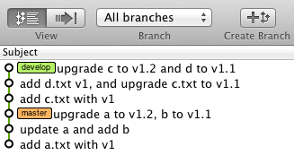
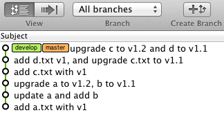
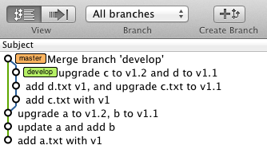

# git备忘
##git的特点
Conceptually, most other systems store information as a list of file-based changes.
其它的vcs都是保存的是基于文件的变更(file-based changes) ,而git保存的是快照(snapshot)

Every time you commit, or save the state of your project in Git, it basically takes a picture of what all your files look like at that moment and stores a reference to that snapshot. To be efficient, if files have not changed, Git doesn't store the file again—just a link to the previous identical file it has already stored. 

每次你提交或是在git里保存你的项目的状态，它会创建一个当前项目所有文件的快照，同时保存一个指向这个快照的引用。为了使这个过程更快，如果一个文件没有发生变化（本次提交没有修改），那git不会再保存一份这个文件，而是保存一个指向上一个变化了版本链接。


Git never allows you to push changes to the remote if there have been remote changes.

git是分布式的scm，分布式体现在哪儿呢？
如果你git clone一个repository,那么，你就有了一个local repository,你在本地所做所有的修改都会被记录到local repository里。
先说说这个local repository吧。 git的local repository是 full function的，跟svn和cvs不一样的是，local repository通常是跟工作目录在一起的。
也就是工作目录就是一个repository!

```
$ git remote    
origin   #这里的origin是一个短名，shortname
$ git remote add pb git://github.com/paulboone/ticgit.git
$ git remote -v
origin git://github.com/schacon/ticgit.git
pb git://github.com/paulboone/ticgit.git
```
如果你想查看remote更详细的信息。 
```
$ git remote show origin  
*remote origin   
  URL: git://github.com/schacon/ticgit.git  
  Remote branch merged with 'git pull' while on branch master   
    master   
  Tracked remote branches   
    master   
    ticgit  
    
```


```
$git clone
--local, -l
           When the repository to clone from is on a local machine, this flag bypasses the normal "git aware" transport mechanism and clones
	如果仓库是在本地，那么这个选项就会忽略(bypasses) git aware 这个传输机制而进行clone
           the repository by making a copy of HEAD and everything under objects and refs directories. The files under .git/objects/
           directory are hardlinked to save space when possible.
	新仓库会复制 HEAD 和 objects,refs目录下的所有东西，如果能可能，.git/objects下的文件硬连接到新仓库。
           If the repository is specified as a local path (e.g., /path/to/repo), this is the default, and --local is essentially a no-op. If
           the repository is specified as a URL, then this flag is ignored (and we never use the local optimizations). Specifying --no-local
           will override the default when /path/to/repo is given, using the regular git transport instead.
	如果要clone的仓库在本地，--local就不起作用。如果仓库的URL是/path/to/repo，而又想用正常的传输方式来clone，请使用--no-local这个选项。
           To force copying instead of hardlinking (which may be desirable if you are trying to make a back-up of your repository), but
           still avoid the usual "git aware" transport mechanism, --no-hardlinks can be used.
	如果强制使用copy，不想使用hardlinking,（当你想为你的repository做个备份的时候，你可能想这样做），但是你又想避免 git aware 传输机制，你可以使用--no-hardlinks选项。

所以整条语句看起来是这样的：
git clone -l --no-hardlinks file:///opt/git_repo/MessageCenter
```

##分支branch
跟svn的分支不一样，git的分支是指向一个commit的指针。可以说是相当轻量级啊。   

创建一个分支：
```
$git branch message-delivery
```
这样就创建了一个branch，（是在本地还是在远程？应该是在本地）,这时查看branch,你会发现你工作的branch并没有改变。    
```
$ git branch
  message-delivery
* master
```
要切到这个分支上开发，你需要checkout
```
$ git checkout message-delivery
$ git branch
* message-delivery
  master
```
你可以一令命令完成创建分支并切换到它。
```
git checkout -b <new-branch>
```

Archive The Repository
First, let’s export our repository into a ZIP archive. Run the following command in your local copy of my-git-repo.

git archive master --format=zip --output=../website-12-10-2012.zip
Or, for Unix users that would prefer a tarball:

git archive master --format=tar --output=../website-12-10-2012.tar
This takes the current master branch and places all of its files into a ZIP archive (or a tarball), omitting the .git directory. Removing the .git directory removes all version control information, and you’re left with a single snapshot of your project.


#### merge

#### Fast Forward
什么是fast forward呢，如果你从master创建了一个分支develop,并在develop分支上开发。


然后呢，你checkout master,     
`$ git merge develop`  
git发现master分支在创建develop分支到merge点这段时间都没有任何commit，实际上你创建的develop分支没有任何意义，你相当于在master上开发，所以git直接到master指向develop最后提交点。合并后的history图如下：    
   
你会发现，你根本看不到曾经有过develop这个分支。也许有人会说，这不是我想要的，我要在merge后保留develop分支。OK，git提供了`--no-ff`这个选项，官方文档的说明是：Create a merge commit even when the merge resolves as a fast-forward.什么意思呢?
意思是，git会创建一个merge commit，即使它发现本次merge经分析后是一个fast-forward merge.
如果我们刚才执行的是
`$ git merge --no-ff develop`   
合并后的history图如下：  
      
怎么样？合并后保留了develop分支完整的历史信息，图看起来漂亮多了吧，：）   

#### Tracking 分支
3.5.2 Tracking Branches
Checking out a local branch from a remote branch automatically creates what is called a tracking branch. 
检出（checkout）一个远程的分支到本地会自动创建一个叫tracking分支的本地分支。

Tracking branches are local branches that have a direct relationship to a remote branch. If you're on a tracking branch and type git push, Git automatically knows which server and branch to push to. Also, running git pull while on one of these branches fetches all the remote references and then automatically merges in the corresponding remote branch.  

tracking分支是远程分支有着直接关系的本地分支。如果你在一个tracking分支上执行`git push`,git会自动知道把内容push到哪个服务器哪个分支上。如果你在tracking分支上执行`git pull`,git会自动把远程分支上的内容取到本地并自动合并。


When you clone a repository, it generally automatically creates a master branch that tracks origin/master. 
That's why git push and git pull work out of the box with no other arguments. However, you can set up other tracking branches if you wish — ones that don't track branches on origin and don't track the master branch. The simple case is the example you just saw, running git checkout -b [branch] [remotename]/[branch]. If you have Git version 1.6.2 or later, you can also use the --track shorthand:
$ git checkout --track origin/serverfix
Branch serverfix set up to track remote branch refs/remotes/origin/ serverfix.
Switched to a new branch "serverfix"

当你clone了一个仓库，它会自动创建一个主分支(master branch)跟踪origin/master。这也是为什么`git push` and `git pull`可以不加参数的正常运行。


To set up a local branch with a different name than the remote branch, you can easily use the first version with a different local branch name:
$ git checkout -b sf origin/serverfix
Branch sf set up to track remote branch refs/remotes/origin/serverfix.
Switched to a new branch "sf"
Now, your local branch sf will automatically push to and pull from origin/serverfix.


##理解Stage
从stage中删除文件    
use "git rm --cached <file>..." to unstage


## git push 出错

* git error: RPC failed; result=22, HTTP code = 411 fatal: The remote end hung up unexpectedly

出现这个错误是因为git命令发起的http请求的包是大小限制的，你push的文件超过了这个限制。解决这个错误很简单，加大这个值就行了。 
```
git config http.postBuffer 524288000
```

* error: RPC failed; result=22, HTTP code = 413 fatal: The remote end hung up unexpectedly

这就是因为你的git web server做了上传文件大小的限制了。我目前用的是gitlab所以修改一下nginx的配置就行了：
```
client_max_body_size 50m;
```


###参考文献    
A successful Git branching model http://nvie.com/posts/a-successful-git-branching-model/   
Useful Git Tips for Beginners http://sixrevisions.com/web-development/git-tips/


